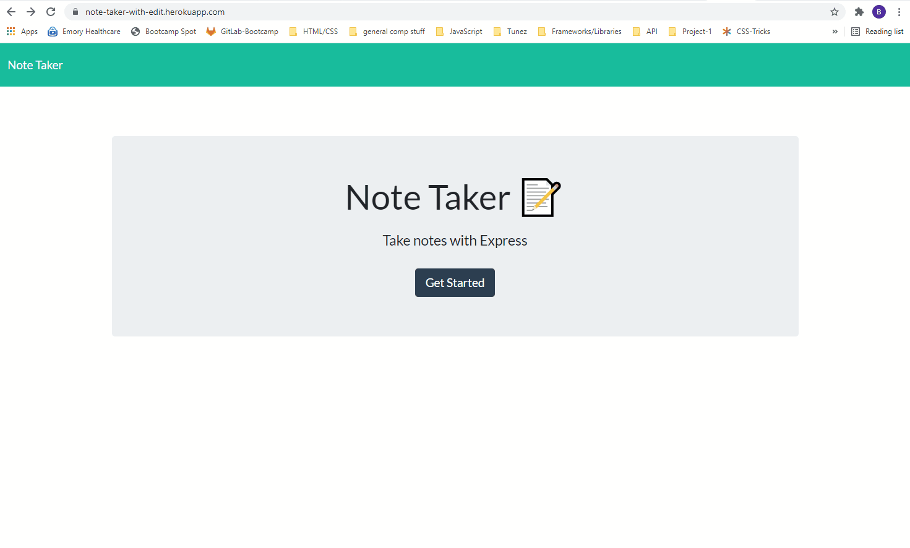

# Note Taker

  

## Description

A simple note taking application that allows the user to Create, View, Edit, or Delete notes stored in the app.

The acceptance criteria for the project only required the ability to View and Create notes, but, to improve user experience, the Edit and Delete features were added.

The code and all relevant files can be found at [github.com/perez-rob/Note-Taker](https://github.com/perez-rob/Note-Taker). 

The deployed application can be accessed here: [note-taker-with-edit.herokuapp.com](https://note-taker-with-edit.herokuapp.com)

## Table of Contents

- [Installation](#installation)

- [Features](#features)

- [Usage](#usage)

- [Credits](#credits)

- [Tests](#tests)

- [Questions](#questions)

- [License](#license)  

## Installation

No installation required. Just go to [note-taker-with-edit.herokuapp.com](https://note-taker-with-edit.herokuapp.com) to use.

## Features  
- Allows users to create, view, edit, and delete notes by linking page events to API routes which make the corresponding changes to the app's database (a server-side json file)

## Usage

After navigating to the app, the 'Get Started' button brings up the notes page. 

- A new note can be added by typing text in the input fields on the right side of the screen. Once the note information is added, clicking the 'Save' icon will add the note to the database and rerender the page with the new note added to the left 
  - if a note is already displayed, click the (+) in the upper right to bring up an empty input to add new notes

- Saved notes are viewed by clicking the title text displayed in the column on the left side of the screen
- Once a note has been clicked and is displayed, it can be edited by clicking the 'Edit' icon that appears above
- Notes can be deleted from the page and database by clicking the red trash icon next to each note in the notes list

## Credits

Solo project for GATech Coding Bootcamp. Starter good for the UI was provided.
by Rob Perez
- [Portfolio Page](https://www.robperez.net)
- rob@robperez.net
- 404.317.5336

## Questions

If you have any questions about the repo, open an issue or contact me directly at bob.w.perez@gmail.com. You can find more of my work at [github/perez-rob](https://github.com/perez-rob).  

## License

This project is licensed under the [GPL v3 License](https://www.gnu.org/licenses/gpl-3.0). 

